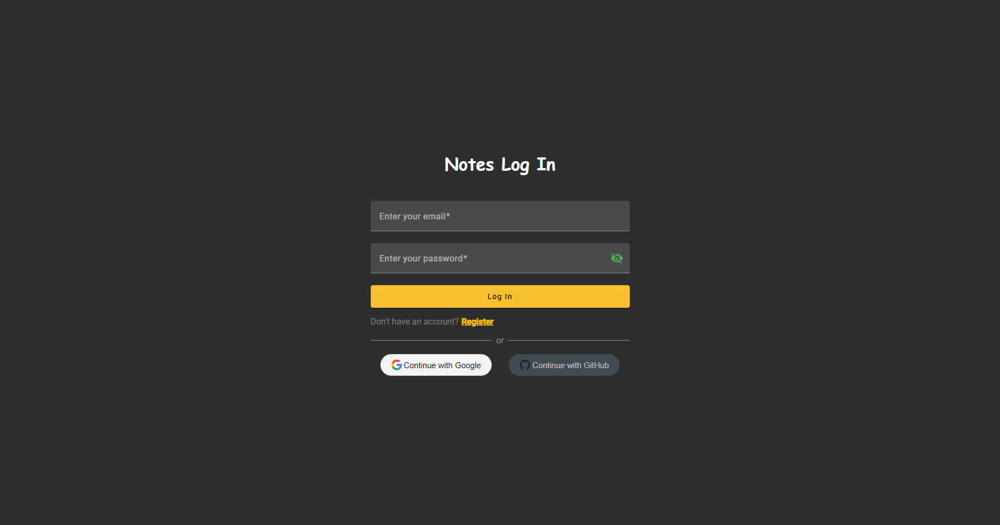
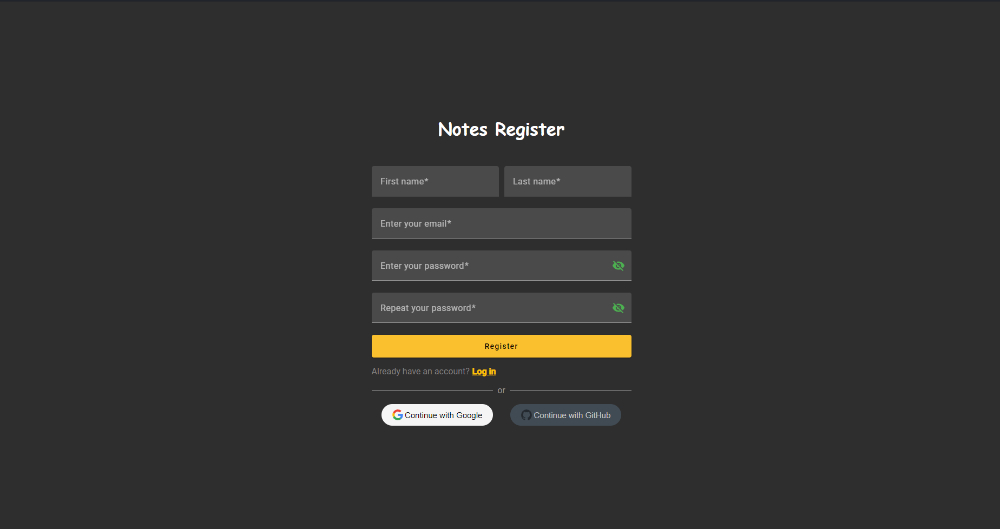
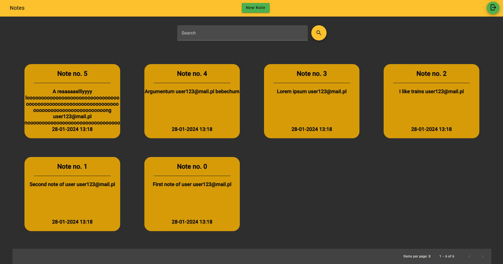
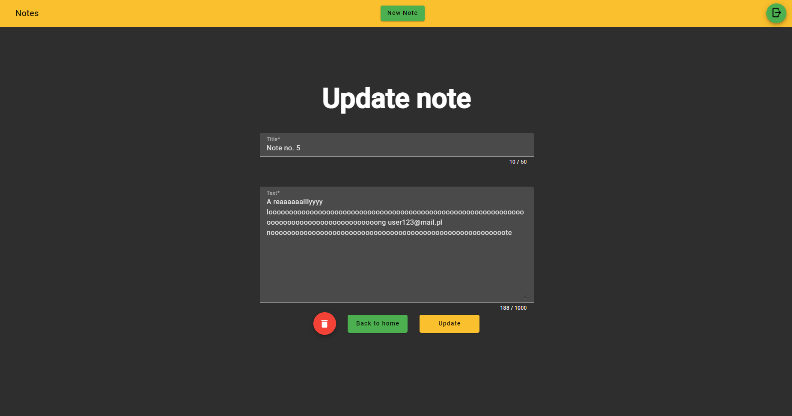
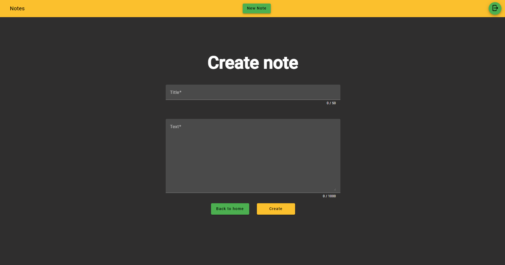
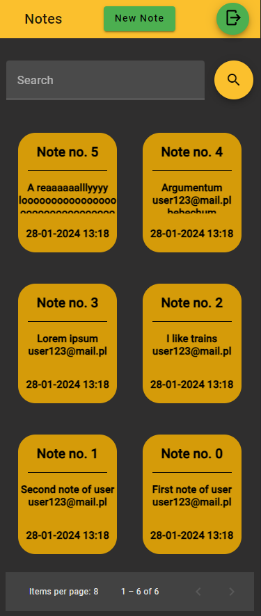

# Notes app

Welcome to the Notes app – a web application designed to help you store and manage your notes. This project serves as a practical exploration of web development basics, covering the integration of backend, database, and frontend, along with authentication using JWT and OAuth and creation of responsive web app. Key features:
   * CRUD
   * Docker
   * Spring backend
   * Angular frontend
   * Postgres database
   * OAuth
   * PWA

# How to run

```
docker compose build
docker compose up -d
```
When all containers are ready visit http://localhost:4200

# Tech stack
1. Backend
   * Java 17
   * Spring Boot 3.1.4
   * Maven
   * Hibernate
   * Spring Data JPA
   * Postgresql
   * Lombok
   * Mapstruct
   * JJWT

2. Frontend
   * Angular 17
   * TypeScript
   * Angular Material
   * Nginx
    
3. Others
   * Docker
   * OAuth

# Screenshots

### Log in page


### Register page


### Home page


### Update note page


### Create note page


## Additionally all pages are fully compatible with smaller screens, for example:

### Home page on mobile
